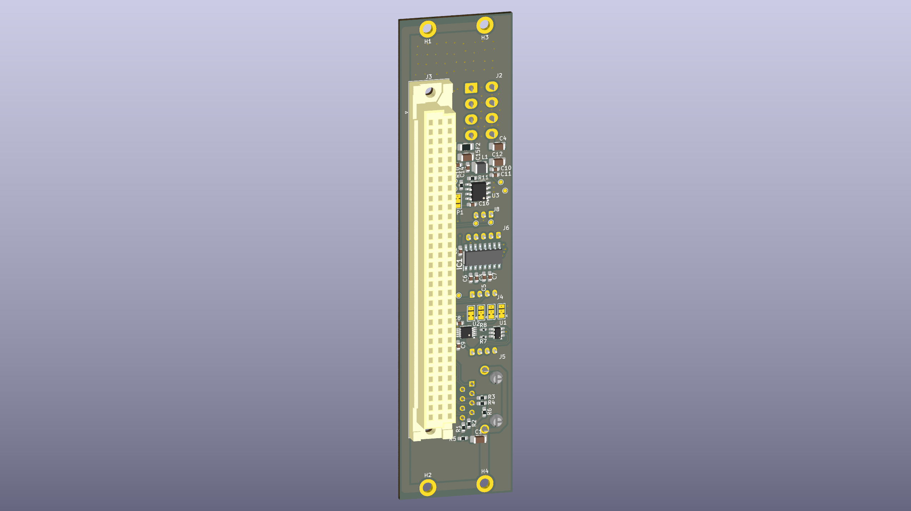

# SCA (Standalone Connector Adapter)
Standalone Connector Adapter for other 3U eurocards. Converts DIN41612 connector to USB, USB(UART converter), ETHERNET and RS485

---
## Status : WIP

- First revision of schematic and PCB is done. 
- Board for testing other boards and their software
  
---

## Features:
- 4x JST PH for USB, USB-UART, RS486 and RS232 
- 10/100/1000 Ethernet connector 
- 3U 6TE eurocard IEEE 1101.1-1998 format (128x30,1 mm)

## License and Contribution

[MIT License](/LICENSE)

Open to contributions in both software and hardware!